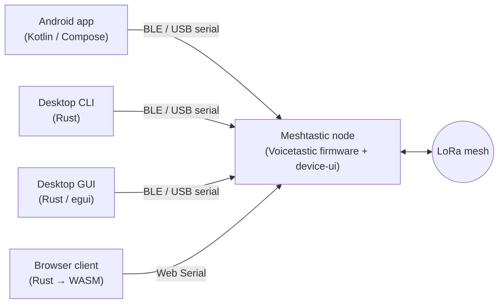

# Voicetastic

Push-to-talk voice messaging, and full radio configuration, over the
[Meshtastic](https://meshtastic.org/) LoRa mesh. No internet, no cellular,
no central server.

This GitHub organization hosts every part of the Voicetastic stack: the
Android app, the Linux desktop client (CLI + GUI + shared core), the
zero-install browser client, the marketing / browser-flasher site, the
vendored codec crates we publish for the browser build, and forks of the
upstream Meshtastic firmware and device UI used to ship Voicetastic-aware
builds.

> Voice messaging is still experimental. The wire protocol (v3) is stable and
> implemented end-to-end across Android, desktop, and the browser client, but
> field-testing on real radios is ongoing. Text messaging and radio
> configuration are the supported paths today.

---

## Projects

| Project | What it is | Language |
|---|---|---|
| [voicetastic/android](https://github.com/voicetastic/android) | Android app. PTT voice, text chat, live mesh roster, full radio config UI. | Kotlin / Compose |
| [voicetastic/voicetastic-core](https://github.com/voicetastic/voicetastic-core) | Linux desktop companion. Workspace of `voicetastic-core` (transport + protocol + voice + codecs), `voicetastic-cli`, `voicetastic-gui` (egui), and `voicetastic-android-bridge` (UniFFI). | Rust |
| [voicetastic/voicetastic-web](https://github.com/voicetastic/voicetastic-web) | Zero-install browser client. Radio plugs into the user's machine over **Web Serial**; `voicetastic-core` compiled to WASM runs the protocol in-page. | Rust → WASM |
| [voicetastic/site](https://github.com/voicetastic/site) | Marketing site + in-browser ESP firmware flasher. Deployed on push to `main`. | Astro / TS |
| [voicetastic/firmware](https://github.com/voicetastic/firmware) | Fork of [meshtastic/firmware](https://github.com/meshtastic/firmware) tracking Voicetastic-specific firmware changes. | C++ / PlatformIO |
| [voicetastic/device-ui](https://github.com/voicetastic/device-ui) | Fork of [meshtastic/device-ui](https://github.com/meshtastic/device-ui) for the on-device LVGL UI. | C++ / LVGL |
| [voicetastic-core wiki](https://github.com/voicetastic/voicetastic-core/wiki) | Normative spec and implementer guide for the Voicetastic Voice Protocol v3. | Markdown |

### Browser-build infrastructure

The browser client compiles the upstream C codec implementations to
WebAssembly via Emscripten. Each codec ships as its own publishable
sibling crate that any Rust + wasm32 project can reuse:

| Crate | What it is | Upstream |
|---|---|---|
| [voicetastic/opencore-amrnb](https://github.com/voicetastic/opencore-amrnb) | Vendored `opencore-amr-nb` → standalone WASM (`emcc -sSTANDALONE_WASM`). Apache-2.0. | [opencore-amr](https://sourceforge.net/projects/opencore-amr/) |
| [voicetastic/libopus](https://github.com/voicetastic/libopus) | Vendored `libopus` 1.5.2 → standalone WASM, FIXED_POINT, with non-variadic ctl wrappers for the JS shim. BSD-3-Clause. | [xiph/opus](https://github.com/xiph/opus) |

---

## How the pieces fit together

Inside that pipe:

| Layer | Detail |
|---|---|
| Transport | BLE service `6ba1b218-15a8-461f-9fa8-5dcae273eafd`, USB serial, or Web Serial; same protobuf framing on all of them. |
| Text | `TEXT_MESSAGE_APP` (port 1). |
| Voice | `PRIVATE_APP` (port 256), 16-byte v3 header. Codecs: AMR-NB (default on Android), Opus, PCM_S16LE, Codec2. The codec is advertised in the header so any client can decode any sender. |
| Config writes | `ADMIN_APP` (port 6). |
| Voice reliability | Reed-Solomon FEC + receiver-driven NACK + sender-side retransmit, implemented once in `voicetastic-core` and re-used by every client: Android through the UniFFI bridge, the browser through the WASM build. |

The normative wire format lives in the
[voicetastic-core wiki](https://github.com/voicetastic/voicetastic-core/wiki/Voice-Protocol);
the reference implementation is
[`crates/voicetastic-core/src/voice/`](https://github.com/voicetastic/voicetastic-core/tree/main/crates/voicetastic-core/src/voice).
The browser client is the same core compiled to `wasm32`. See
[voicetastic-web's README](https://github.com/voicetastic/voicetastic-web)
for the WASM driver.

---

## Getting started

Pick a path:

* **Just want to try it on a radio?** Flash a Voicetastic firmware build from
  the [site's `/flash` page](https://github.com/voicetastic/site), then
  pick a client:
  * [voicetastic-web](https://github.com/voicetastic/voicetastic-web):
    nothing to install; plug the radio into your machine and open the page in
    Chrome/Edge or Firefox 151+.
  * [Android app](https://github.com/voicetastic/android): pairs over BLE.
  * [desktop client](https://github.com/voicetastic/voicetastic-core):
    CLI + egui GUI for Linux, over BLE or USB serial.
* **Building from source?** Each repo has its own README with prerequisites
  and build instructions. The desktop repo pulls
  [meshtastic/protobufs](https://github.com/meshtastic/protobufs) as a
  submodule; clone with `--recurse-submodules`. The web repo pulls
  `voicetastic-core` via a pinned git dependency (no sibling checkout needed
  as of the GitHub migration).
* **Implementing the protocol elsewhere?** Start with the
  [Overview](https://github.com/voicetastic/voicetastic-core/wiki/Overview),
  then [Frame Format](https://github.com/voicetastic/voicetastic-core/wiki/Frame-Format),
  then the [Sender](https://github.com/voicetastic/voicetastic-core/wiki/Sender-Guide)
  and [Receiver](https://github.com/voicetastic/voicetastic-core/wiki/Receiver-Guide) guides.

---

## Contributing

Voicetastic is a hobby / research project; issues, ideas, and pull requests
are welcome on any of the repos above. If you're changing protocol-affecting
code, please update the wiki in the same PR so the spec keeps tracking the
implementation.

---

## License

All Voicetastic-authored code is distributed under the
[GNU General Public License v3.0 or later](https://www.gnu.org/licenses/gpl-3.0.html)
(`SPDX-License-Identifier: GPL-3.0-or-later`).

The `firmware` and `device-ui` forks retain their upstream licenses
(GPL-3.0-only, see each repo's `LICENSE`). The vendored codec crates
[`opencore-amrnb`](https://github.com/voicetastic/opencore-amrnb) and
[`libopus`](https://github.com/voicetastic/libopus) retain their upstream
licenses (Apache-2.0 and BSD-3-Clause respectively).

---

## Credits

* The [Meshtastic project](https://meshtastic.org/) for the open mesh
  firmware, BLE protocol, and protobuf definitions that everything here
  builds on.
